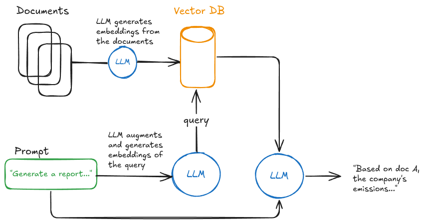

# eco-reporting

## Context
From 2025 onwards, over 50.000 companies in the EU need to report about sustainability matters based on the newly created ESRS (European Sustainability Reporting Standards). These strict standards for sustainability reporting are written down in a >200 pages explanation. (https://xbrl.efrag.org/e-esrs/esrs-set1-2023.html)
Our product helps sustainability teams to generate ESRS conform reporting text based on existing document’s information. It also helps to check, whether or not the generated or written reporting text is already fulfilling the strict standards correctly

### Report Gaps
One part of the standard is about Climate Change (E1).
When companies report about climate change, they have to disclose their “Transition plan for climate change mitigation” (E1-1). 
In order to analyse a company report gaps in relation to the european standards, a 2 stage solution was implemented. The first step is to, via prompt-engineering, define the main components that a complete report should contain. In the same task, evaluate the report against these components, and identify what is lacking, with a final output of a list of gaps and the detailed explanation of what they should contain.
The second step is to provide further context on how these gaps can be reported, by providing an example of each from an industry best-practice report.
This could have been done in a single-prompt manner, or further divided into more isolated tasks, depending on multiple considerations: performance of multi vs single prompt as contexts grow larger, price and latency requirements.
As price is not substantially different (since cost is handled on input/output token basis and not request basis), the performance and latency would be the two main factors to decide, at a production level, the best approach.

#### *What other features could help companies reporting on Climate Change?*
- [] An **intelligent search system** for relevant documentation: a query, natural language based system that uses RAG to analyze the company's existing documentation and extract relevant information to a specific question. 
  - This can be helful to navigate documentation heavy environments, where the necessary information for reports can already exist but is unorganized or unstructured, causing for difficult navigation
- [] A **summarizer/highlighter system for legislation**: since legislation can be dense and often changing, a system which reads legislation documentation and highlights main components/changes from previous standards can be important to keep companies updated on their reporting requirements
- [] A **report writer**: in a fully mature system, that has access to both previously defined features, as well as a evaluation module that corrects/signals uncertainty in a proposal report, we can have a proposal report writer that only needs to be reviewed by humans instead of created from scratch

### Architecture for RAG system
To build a feature using retrieval augmented generation, a possible architecture would look like this: 

Some important considerations to implement such an architecture in production would be:
1. Vector Database Hosting: how can the vector database be hosted (self-hosted vs hosted solutions)
2. Vector Database Generation: how the documentation should be fed into the database ensuring its quality
  - To handle different documents formats, a consumer application should be built with independent parsers for each format, so that they can be embedded with specific knowledge if required. Currently open source packages exist that allows reading virtually any file format (such as langchain or llama-index). This allows the storing of tabular data, images associated to documents, etc. Everything is stored associated to metadata like file name, page, etc that can be used to reconstitute a document.
  - The information needs to breaked down into smaller pieces (chunks) that can ensure a more efficient use of the embedding models and allows retrieving smaller, more specific chunks to generate content. These chunks can have either fixed sizes or random sizes, be captured over sliding windows, or have specific sizes obtained from text-preprocessing (such as chunking by paragraph).
  - Often the simplest, starter solution is to chunk by fixed size.
3. Search Options: what type of search is used to retrieve the context
  - 
4. Prompting: what queries would be used to prompt the context retrieval and the report generation
5. Model: choosing the most appropriate LLMs and hosting type for both the embedding and generation tasks

2. How would you extract various different documents information? (PDFs, Excels, PPTX, Words, …)
3. How would you break document information into pieces?
4. What different options do you see for the classification/search?

